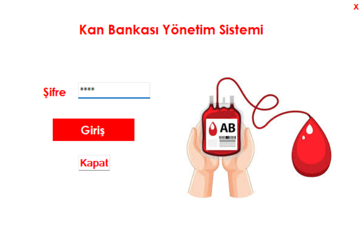
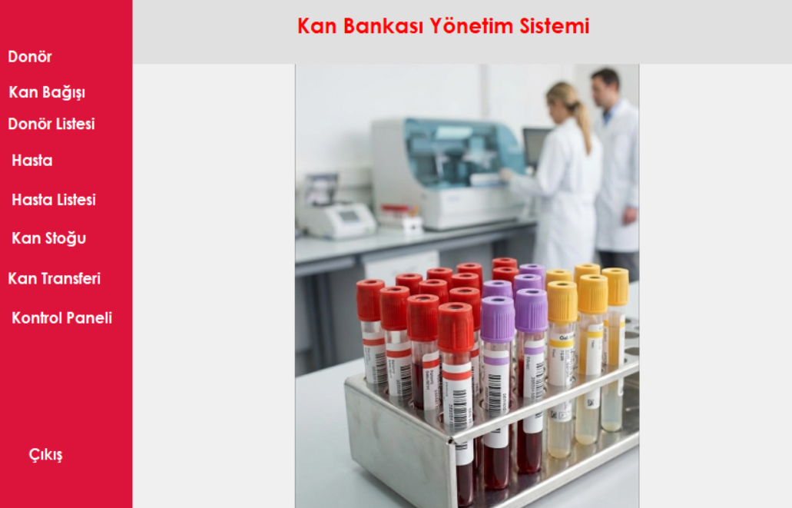
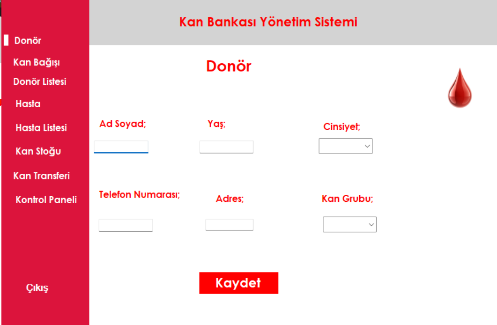
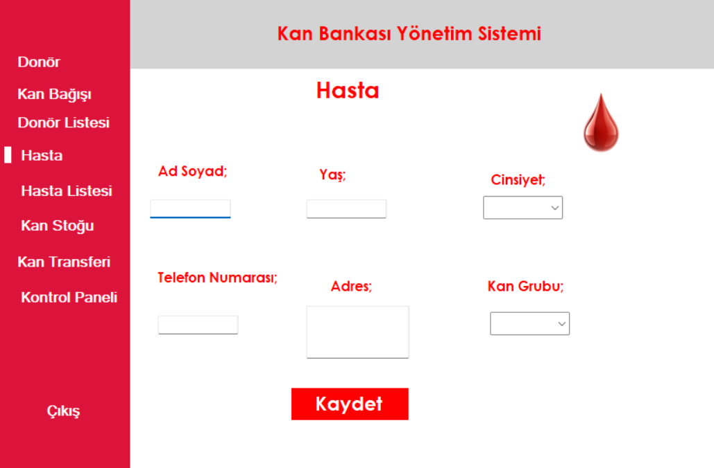
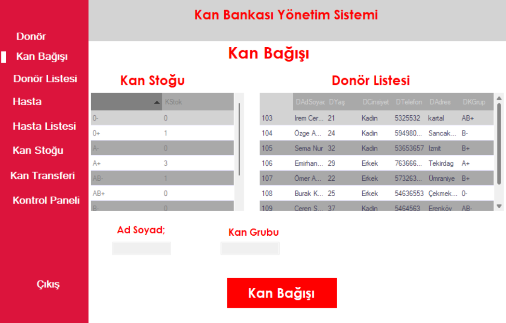

# Kan Bağışı Otomasyonu

Bu proje C# Windows Forms kullanılarak geliştirilmiş bir kan bağışı otomasyon sistemidir.

## Özellikler
- Admin ve kullanıcı girişi
- Donör kayıt işlemleri
- Hasta kayıt ve listeleme
- Kan bağışı yönetimi
- SQL veritabanı bağlantısı

## Kullanılan Teknolojiler
- C#
- Windows Forms
- SQL Server

## Projeyi Çalıştırma
1. `WindowsFormsApp1.sln` dosyası Visual Studio ile açılır
2. Veritabanı bağlantısı ayarlanır
3. Proje çalıştırılır

## Form Ekran Görüntüleri

### Admin Giriş

### Ana Sayfa

### Donör Formu

### Hasta Formu

### Kan Bağışı

> Not: Görseller proje içerisinde Resources klasörü altında yönetilmektedir.
